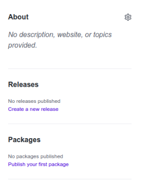
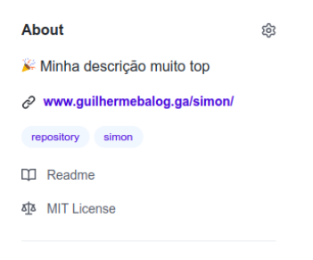

# Simon Talk Git e Github

Simon Talk mostrando o Git e algumas *features* do GitHub


## README

O arquivo `README.md` é um arquivo especial no GitHub, ele é escrito com a linguagem markdown (`.md`) e permite que você mostre informações sobre o seu repositório.

Algumas coisas legais pra colocar no README:

- **Multimídia**
  - Logo do projeto
  - vídeo de demonstração,
  - trechos de código
  - tudo mais pra que as pessoas entendam do que se trata.
- **Como se usa o código?**
  - Coloque também informações de como o leitor pode utilizar o código:
    - O que precisa pra rodar o projeto
    - Como instalar as coisas do projeto pra codar
    - Como acessar ou usar seu projeto (Link pro site, como instalar na máquina, etc).
  - Isso vai ser útil até mesmo pra você, quando você voltar pra ver esse projeto de um tempo!
- **Descreva o código**
  - O que o código faz?
  - Qual a estrutura de código você utilizou?
  - Como você organizou suas classes, ou componentes, ou funções.
  - Aquele código cabuloso que você fez e pensou *"Caramba, sou o próximo [Alan Turing](https://pt.wikipedia.org/wiki/Alan_Turing)"* ou *"Sou a própria [Ada Lovelace](https://pt.wikipedia.org/wiki/Ada_Lovelace)"*.
- **Cite suas referências principais**
  - Onde você aprendeu a parte principal?
  - Como corrigiu um bug específico?
  - De onde veio sua ideia?

Para algumas dicas de coisas pra colocar no seu README e mais,  veja este vídeo: https://www.youtube.com/watch?v=yMRSDdifGW8

E alguns exemplos:

- Pra galera do JS, README do React: https://github.com/facebook/react#readme
- Pra galera do PHP, README do Laravel: https://github.com/laravel/laravel#readme
- Pra galera do Java, README do Kotlin: https://github.com/JetBrains/kotlin#readme
- Pra galera do Java Raiz, README do Spring Boot: https://github.com/spring-projects/spring-boot#readme
- Pra galera de Dados, README do Python: https://github.com/python/cpython#readme

### Sobre markdown

Ele é convertido para HTML, e permite que você escreva HTML nele também. Você pode utilizar em vários lugares, como:

- README no Github
- Comentários em PR's
- Ferramentas de Blog
- [Notion.so](https://www.notion.so/)
- [Discord](https://gist.github.com/matthewzring/9f7bbfd102003963f9be7dbcf7d40e51)

Para aprender como escrever em markdown, veja: https://www.markdownguide.org/basic-syntax/

## Co-authors

Muitas vezes ao fazer *pair programming* ou *mob programming* mais de uma pessoa trabalhou no código de um commit, então nada mais justo que dar os créditos

Para isso, temos que acrescentar o nome e o email de quem fez junto na mensagem do commit, mas como?

Geralmente se faz um commit assim:

```sh
git commit -m "Adiciona cadastro de usuário"
```

Mas também é possível fazer mensagens mais longas, como um email, basta dar Enter antes de fechar as aspas:

```sh
git commit -m "Adiciona cadastro de usuário

Utilizei a biblioteca user-create para
implementar o cadastro, falta a verificação de senha.
"
```

E é justamente nessa mensagem mais longa que adicionamos `Co-authored-by: NOME DA PESSOA <pessoa@email.com>`, utilizando o mesmo email cadastrado no GitHub:

```sh
git commit -m "Adiciona cadastro de usuário

Co-authored-by: Simon Jr <simon.jr@sintesejr.com.br>
"
```

## Detalhes do repositório

Algumas informações são exibidas na página inicial do repositório, e dão uma cara mais *pro* quando estão bonitinhas. São elas:

- **Descrição:** Um breve resumo sobre o repositório. Eu gosto sempre de colocar um emoji no começo 💁🏾. Uso bastante o site [getemoji.com](https://getemoji.com/) pra procurar.
- **Tags:** Você pode colocar tags, geralmente eu coloco as linguagens, bibliotecas e coisas relacionadas com o tema do projeto.
- **Licença:** É bem importante nos projetos, e dá uma cara bonitinha ao seu projeto. Vai que alguém acha seu repositório e queria usar seu código? Com uma licença você deixa claro que pode (ou que não)! Normalmente eu uso a licença **MIT**, que permite uso gratuito, inclusive para uso comercial, ou seja, todo mundo pode usar o código. Para saber mais e conhecer outras licenças tem site do próprio GitHub chamado [choosealicense.github.iom/](https://choosealicense.com/). Para adicionar uma licença, basta na página do repositório ir em `Add file -> Create new file` e colocar o nome de arquivo como `LICENSE`, automaticamente aparece um botão "Choose a license template" e então é só escolher a licença.
- **Link de acesso:** dá pra colocar uma URL pro site do projeto, ou da documentação.
- **Extra:** Eu aproveito pra desmarcar os campos "Releases" e "Packages"

Com isso, temos o antes e depois:




Muito melhor né?

## Gitignore

O gitignore serve para ignorar arquivos do versionamento, esse site ajuda a criar um para várias linguagens: https://www.toptal.com/developers/gitignore


## GitHub Pages

É possível colocar seu site no ar de um jeito muito fácil e de graça utilizando o GitHub. Basta que seu repositório possua os arquivos `.html` que formam o site. Pode ser em uma *branch* separada, ou na própria master.
No [repositório da talk](https://github.com/GuilhermeBalog/simon), por exemplo, na raíz tem um arquivo `index.html` e os outros necessários (js, css, imagens). Com isso é só ir na aba de opções e procurar por GitHub pages, selecionar onde está o código e pronto! O site vai estar disponível em `<username>.github.io/<repositório>`, no meu caso [guilhermebalog.github.io/simon-talk-git-github](https://guilhermebalog.ga/simon-talk-git-github/).

Também é possível fazer um site dedicado ao seu usuário ou organização. Para isso, crie um repositório chamado `<username>.github.io`, no meu caso [guilhermebalog.github.io](https://github.com/GuilhermeBalog/guilhermebalog.github.io), e jogue o código do site lá. A página estará disponível em `<username>.github.io`.

O GHPages é Perfeito para **sites estáticos** (normalmente que não tem backend), **aplicações React** (ou outras libs de front) e **documentações** (javadoc, por exemplo).

Legal para seu site pessoal, ou portfólio. Você não paga nada e já tem um link pra chamar de seu.

É bom que o nome do repositório seja sempre em minúsculo, sem caracteres especiais e separado por traço (por causa da URL gerada). Eu tenho um repositório chamado TodoList, que tem o seguinte problema
  - [guilhermebalog.github.io/todolist](https://guilhermebalog.ga/todolist) → erro 404
  - [guilhermebalog.github.io/TodoList/](https://guilhermebalog.ga/TodoList/) → Funciona

Eu sei que ninguém digita a URL na mão, mas no geral URLs são sempre minúsculas.

É possível utilizar em vários tipos de projetos, como:

- Documentação de um projeto java gerada com o javadoc:
[guilhermebalog.github.io/java-pong/](https://guilhermebalog.ga/java-pong/)
- Documentação de uma API gerada com o [Insomnia Documenter](https://github.com/jozsefsallai/insomnia-documenter):
[guilhermebalog.github.io/ru-scraping/](https://guilhermebalog.ga/ru-scraping/)
- Página de HTML estática (HTML, CSS, JS):
[guilhermebalog.github.io/tic-tac-toe/](https://guilhermebalog.ga/tic-tac-toe/)
- Aplicação criada com Create React App:
[guilhermebalog.github.io/mother-weather/](https://guilhermebalog.ga/mother-weather/)
- Página gerada automaticamente a partir do README:
[guilhermebalog.github.io/algoritmo-cyk/](https://guilhermebalog.ga/algoritmo-cyk/)

Para mais informações, veja: https://pages.github.com/

Tutorial de como publicar sites em React no gh-pages: https://create-react-app.dev/docs/deployment/#github-pages

## GitHub Actions

As Actions são scripts que rodam que rodam quando determinados eventos acontecem. Dá pra executar os testes quando uma pull request foi feita, fazer um deploy de preview, integração contínua e até mandar mensagem no discord!

Para criar uma action, na raíz do projeto crie uma pasta chamada `.github` e dentro dela mais uma pasta chamada `workflows` e dentro dela são criados os arquivos. Cada arquivo `.yml` corresponde a uma action.

O arquivo basicamente é uma receita que diz o que a ação deve fazer, e geralmente usa uma ou mais actions de terceiros, que já fazem alguma coisa.

Aqui vai uma action para mandar uma mensagem no Discord toda vez que é feita uma PR:

```yml
name: Notificação

on: pull_request

jobs:
  notify_pull_request:
    runs-on: ubuntu-latest
    steps:
      - name: Discord notification
        env:
          DISCORD_WEBHOOK: ${{ secrets.DISCORD_WEBHOOK }}
          DISCORD_EMBEDS: '[{ "title": "${{ github.event.pull_request.title }}", "timestamp": "${{ github.event.pull_request.updated_at }}", "author": { "name": "${{ github.event.sender.login }}", "icon_url": "${{ github.event.sender.avatar_url }}}"}, "url": "${{ github.event.pull_request.html_url }}" }]'
          DISCORD_USERNAME: ${{ github.event.repository.name }}
        uses: Ilshidur/action-discord@master
        with:
          args: '**[{{ EVENT_PAYLOAD.sender.login }}]({{ EVENT_PAYLOAD.sender.html_url }})** abriu uma pull request no projeto **[{{ EVENT_PAYLOAD.repository.full_name }}]({{ EVENT_PAYLOAD.repository.html_url }}):** {{ EVENT_PAYLOAD.pull_request.body }}'
```

- Definimos o nome:
    ```yml
    name: Notificação
    ```
- Definimos quando a ação vai ser executada:
    ```yml
    on: pull_request
    ```
- Definimos o que vai ser feito nos `steps`:
  - Definir variáveis ambiente:
      ```yml
      env:
          DISCORD_WEBHOOK: ${{ secrets.DISCORD_WEBHOOK }}
          DISCORD_EMBEDS: '[{ "title": "${{ github.event.pull_request.title }}", "timestamp": "${{ github.event.pull_request.updated_at }}", "author": { "name": "${{ github.event.sender.login }}", "icon_url": "${{ github.event.sender.avatar_url }}}"}, "url": "${{ github.event.pull_request.html_url }}" }]'
          DISCORD_USERNAME: ${{ github.event.repository.name }}
      ```

      `DISCORD_WEBHOOK` é um código que pode ser obtido nas configurações do canal do Discord, e você adiciona nos Secrets do repositório, na aba de configurações do repositório com o nome `DISCORD_WEBHOOK`.

      `DISCORD_EMBED S` são aqueles cards anexados na mensagem do discord. Essa formatação coloca o nome da pull request, quando ela foi modificada, quem fez a pull request com a foto e um link pra PR.

      `DISCORD_USERNAME` é o nome de quem ta mandando a mensagem, no caso está configurado como o nome do repositório.
  - Usamos a action externa `Ilshidur/action-discord` passando os argumentos, que nesse caso é só a mensagem a ser enviada. A mensagem fica como `"GuilhermeBalog abriu uma pull request no projeto Sintese-Jr/ecommerce: Adiciona cadastro de usuário"`, com um link para o usuário e pro projeto
      ```yml
      uses: Ilshidur/action-discord@master
        with:
          args: '**[{{ EVENT_PAYLOAD.sender.login }}]({{ EVENT_PAYLOAD.sender.html_url }})** abriu uma pull request no projeto **[{{ EVENT_PAYLOAD.repository.full_name }}]({{ EVENT_PAYLOAD.repository.html_url }}):** {{ EVENT_PAYLOAD.pull_request.body }}'
      ```

Uma action que uso frequentemente é publicar um projeto React (ou qualquer projeto que precise rodar um build antes) no github pages:

```yml
name: Deployment
on:
  push:
    branches:
      - master
jobs:
  deploy:
    runs-on: ubuntu-latest
    strategy:
      matrix:
        node-version: [12.x]
    steps:
    - uses: actions/checkout@v1
    - name: Use Node.js ${{ matrix.node-version }}
      uses: actions/setup-node@v1
      with:
        node-version: ${{ matrix.node-version }}
    - name: Install Packages
      run: npm install
    - name: Build page
      run: npm run build
    - name: Deploy to gh-pages
      uses: peaceiris/actions-gh-pages@v3
      with:
        github_token: ${{ secrets.GITHUB_TOKEN }}
        publish_dir: ./build
```
